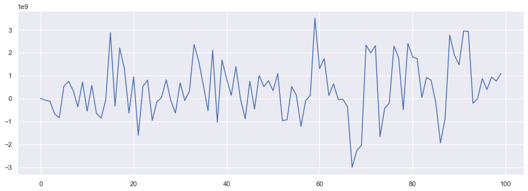
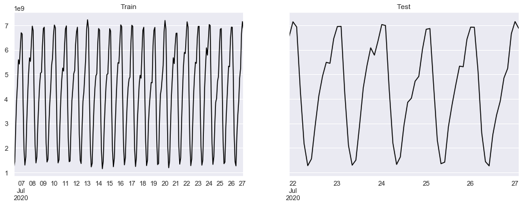
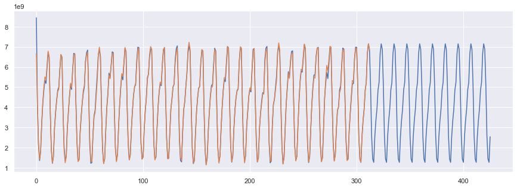
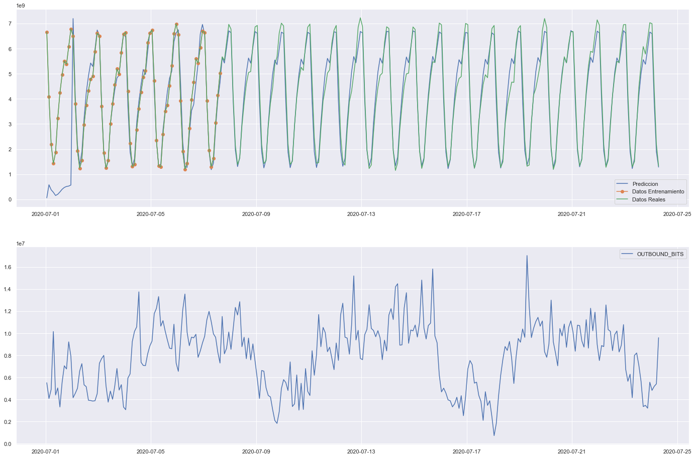

# **Practico Mentoria - Aprendizaje Supervisado**

Se propone la elaboración de un informe o presentación, en formato estatico:
* PDF
* Markdowns
* Google Docs

Que responda a las cuestiones solicitadas en cada seccion de esta **Jupyter Notebook**.

La comunicación debe estar apuntada a un público técnico pero sin conocimiento del tema particular, como por ejemplo, sus compañeros de clase.  
Por lo cual debe estar redactado de forma consisa y comprensible.

## **Referencias**

* https://relopezbriega.github.io/blog/2016/09/26/series-de-tiempo-con-python/
* https://www.analyticslane.com/2018/08/15/manipulacion-series-temporales-con-pandas/
* http://www.escuela-verano.otrasenda.org/wp-content/uploads/2015/06/curso_series.pdf
* https://medium.com/datos-y-ciencia/modelos-de-series-de-tiempo-en-python-f861a25b9677


```python
import numpy as np
import pandas as pd
import matplotlib.pyplot as plt
import seaborn as sns
import datetime
import statsmodels.api as sm

from scipy import stats

import warnings
warnings.filterwarnings('ignore')
```


```python
sns.set_style('whitegrid')
sns.set(rc={'figure.figsize':(15, 5)})
```


```python
filename = "https://raw.githubusercontent.com/diplodatos2020/Introduccion_Mentoria/master/dataset_inf_telec_20200501T130000_20200727T010000_v1.csv"
```


```python
df = pd.read_csv(
    filename,
    dtype={
        'ID_EQUIPO': int,
        'PUNTO_MEDICION': str,
        'CAPACIDAD_MAXIMA_GBS': float,
        'PASO': int,
        'LATENCIA_MS': float,
        'PORCENTAJE_PACK_LOSS': float,
        'INBOUND_BITS': np.float64,
        'OUTBOUND_BITS': np.float64,
        'MEDIDA': str,
    },
    index_col='FECHA_HORA',
    parse_dates=[
        'FECHA_INICIO_MEDICION',
        'FECHA_HORA',
        'FECHA_FIN_MEDICION',
    ],
    na_values=['NaN']
)

print(df.shape)
display(df.head(10))
```

    (61548, 11)
    


<div>
<style scoped>
    .dataframe tbody tr th:only-of-type {
        vertical-align: middle;
    }

    .dataframe tbody tr th {
        vertical-align: top;
    }

    .dataframe thead th {
        text-align: right;
    }
</style>
<table border="1" class="dataframe">
  <thead>
    <tr style="text-align: right;">
      <th></th>
      <th>ID_EQUIPO</th>
      <th>PUNTO_MEDICION</th>
      <th>CAPACIDAD_MAXIMA_GBS</th>
      <th>FECHA_INICIO_MEDICION</th>
      <th>FECHA_FIN_MEDICION</th>
      <th>PASO</th>
      <th>LATENCIA_MS</th>
      <th>PORCENTAJE_PACK_LOSS</th>
      <th>INBOUND_BITS</th>
      <th>OUTBOUND_BITS</th>
      <th>MEDIDA</th>
    </tr>
    <tr>
      <th>FECHA_HORA</th>
      <th></th>
      <th></th>
      <th></th>
      <th></th>
      <th></th>
      <th></th>
      <th></th>
      <th></th>
      <th></th>
      <th></th>
      <th></th>
    </tr>
  </thead>
  <tbody>
    <tr>
      <th>2020-05-01 03:00:00</th>
      <td>25</td>
      <td>ABA - Abasto Cliente</td>
      <td>1.0</td>
      <td>2020-05-01 01:00:00.000</td>
      <td>2020-05-28 13:00:00.000</td>
      <td>7200</td>
      <td>0.636025</td>
      <td>0.0</td>
      <td>2.574323e+06</td>
      <td>5.511033e+06</td>
      <td>MB</td>
    </tr>
    <tr>
      <th>2020-05-01 05:00:00</th>
      <td>25</td>
      <td>ABA - Abasto Cliente</td>
      <td>1.0</td>
      <td>2020-05-01 01:00:00.000</td>
      <td>2020-05-28 13:00:00.000</td>
      <td>7200</td>
      <td>0.604169</td>
      <td>0.0</td>
      <td>2.890153e+06</td>
      <td>4.081183e+06</td>
      <td>MB</td>
    </tr>
    <tr>
      <th>2020-05-01 07:00:00</th>
      <td>25</td>
      <td>ABA - Abasto Cliente</td>
      <td>1.0</td>
      <td>2020-05-01 00:59:59.995</td>
      <td>2020-05-28 12:59:59.995</td>
      <td>7200</td>
      <td>0.630580</td>
      <td>0.0</td>
      <td>2.152505e+06</td>
      <td>4.904134e+06</td>
      <td>MB</td>
    </tr>
    <tr>
      <th>2020-05-01 09:00:00</th>
      <td>25</td>
      <td>ABA - Abasto Cliente</td>
      <td>1.0</td>
      <td>2020-05-01 00:59:59.995</td>
      <td>2020-05-28 12:59:59.995</td>
      <td>7200</td>
      <td>0.643044</td>
      <td>0.0</td>
      <td>6.436357e+06</td>
      <td>1.015017e+07</td>
      <td>MB</td>
    </tr>
    <tr>
      <th>2020-05-01 11:00:00</th>
      <td>25</td>
      <td>ABA - Abasto Cliente</td>
      <td>1.0</td>
      <td>2020-05-01 00:59:59.995</td>
      <td>2020-05-28 12:59:59.995</td>
      <td>7200</td>
      <td>0.620542</td>
      <td>0.0</td>
      <td>3.173940e+06</td>
      <td>4.403766e+06</td>
      <td>MB</td>
    </tr>
    <tr>
      <th>2020-05-01 13:00:00</th>
      <td>25</td>
      <td>ABA - Abasto Cliente</td>
      <td>1.0</td>
      <td>2020-05-01 00:59:59.995</td>
      <td>2020-05-28 12:59:59.995</td>
      <td>7200</td>
      <td>0.611687</td>
      <td>0.0</td>
      <td>1.818024e+06</td>
      <td>5.041605e+06</td>
      <td>MB</td>
    </tr>
    <tr>
      <th>2020-05-01 15:00:00</th>
      <td>25</td>
      <td>ABA - Abasto Cliente</td>
      <td>1.0</td>
      <td>2020-05-01 00:59:59.995</td>
      <td>2020-05-28 12:59:59.995</td>
      <td>7200</td>
      <td>0.647121</td>
      <td>0.0</td>
      <td>2.269738e+06</td>
      <td>3.317918e+06</td>
      <td>MB</td>
    </tr>
    <tr>
      <th>2020-05-01 17:00:00</th>
      <td>25</td>
      <td>ABA - Abasto Cliente</td>
      <td>1.0</td>
      <td>2020-05-01 00:59:59.995</td>
      <td>2020-05-28 12:59:59.995</td>
      <td>7200</td>
      <td>0.613206</td>
      <td>0.0</td>
      <td>3.333695e+06</td>
      <td>5.551954e+06</td>
      <td>MB</td>
    </tr>
    <tr>
      <th>2020-05-01 19:00:00</th>
      <td>25</td>
      <td>ABA - Abasto Cliente</td>
      <td>1.0</td>
      <td>2020-05-01 00:59:59.995</td>
      <td>2020-05-28 12:59:59.995</td>
      <td>7200</td>
      <td>0.619800</td>
      <td>0.0</td>
      <td>4.434273e+06</td>
      <td>7.047717e+06</td>
      <td>MB</td>
    </tr>
    <tr>
      <th>2020-05-01 21:00:00</th>
      <td>25</td>
      <td>ABA - Abasto Cliente</td>
      <td>1.0</td>
      <td>2020-05-01 00:59:59.995</td>
      <td>2020-05-28 12:59:59.995</td>
      <td>7200</td>
      <td>0.613213</td>
      <td>0.0</td>
      <td>2.895002e+06</td>
      <td>6.761176e+06</td>
      <td>MB</td>
    </tr>
  </tbody>
</table>
</div>


```python
print(df.index.min())

print(df.index.max())
```

    2020-05-01 03:00:00
    2020-07-27 01:00:00
    


```python
df_missing_values_count = df.isnull().sum()
df_missing_values_count[df_missing_values_count > 0]
```


    LATENCIA_MS             48
    PORCENTAJE_PACK_LOSS    49
    INBOUND_BITS            47
    OUTBOUND_BITS           47
    dtype: int64


```python
df_notnull = df[pd.notnull(df['PORCENTAJE_PACK_LOSS'])]
print('LATENCIA_MS ', df_notnull.LATENCIA_MS.isnull().sum())
print('PORCENTAJE_PACK_LOSS ', df_notnull.PORCENTAJE_PACK_LOSS.isnull().sum())
print('OUTBOUND_BITS ', df_notnull.OUTBOUND_BITS.isnull().sum())
print('INBOUND_BITS ', df_notnull.INBOUND_BITS.isnull().sum())

df_notnull.shape
```

    LATENCIA_MS  0
    PORCENTAJE_PACK_LOSS  0
    OUTBOUND_BITS  0
    INBOUND_BITS  0
    


    (61499, 11)


---

## **Basic Time Series Forecasting**

En este practico aplicaremos métodos básicos de forecasting.

Elija algun `PUNTO_MEDICION`, por ejemplo **BAZ - Yocsina**.

Vamos a hacer forecasting sobre la variable `INBOUND_BITS` de dicho punto de medición.


```python
df_new = df
df_new
```


<div>
<style scoped>
    .dataframe tbody tr th:only-of-type {
        vertical-align: middle;
    }

    .dataframe tbody tr th {
        vertical-align: top;
    }

    .dataframe thead th {
        text-align: right;
    }
</style>
<table border="1" class="dataframe">
  <thead>
    <tr style="text-align: right;">
      <th></th>
      <th>ID_EQUIPO</th>
      <th>PUNTO_MEDICION</th>
      <th>CAPACIDAD_MAXIMA_GBS</th>
      <th>FECHA_INICIO_MEDICION</th>
      <th>FECHA_FIN_MEDICION</th>
      <th>PASO</th>
      <th>LATENCIA_MS</th>
      <th>PORCENTAJE_PACK_LOSS</th>
      <th>INBOUND_BITS</th>
      <th>OUTBOUND_BITS</th>
      <th>MEDIDA</th>
    </tr>
    <tr>
      <th>FECHA_HORA</th>
      <th></th>
      <th></th>
      <th></th>
      <th></th>
      <th></th>
      <th></th>
      <th></th>
      <th></th>
      <th></th>
      <th></th>
      <th></th>
    </tr>
  </thead>
  <tbody>
    <tr>
      <th>2020-05-01 03:00:00</th>
      <td>25</td>
      <td>ABA - Abasto Cliente</td>
      <td>1.0</td>
      <td>2020-05-01 01:00:00.000</td>
      <td>2020-05-28 13:00:00.000</td>
      <td>7200</td>
      <td>0.636025</td>
      <td>0.000000</td>
      <td>2.574323e+06</td>
      <td>5.511033e+06</td>
      <td>MB</td>
    </tr>
    <tr>
      <th>2020-05-01 05:00:00</th>
      <td>25</td>
      <td>ABA - Abasto Cliente</td>
      <td>1.0</td>
      <td>2020-05-01 01:00:00.000</td>
      <td>2020-05-28 13:00:00.000</td>
      <td>7200</td>
      <td>0.604169</td>
      <td>0.000000</td>
      <td>2.890153e+06</td>
      <td>4.081183e+06</td>
      <td>MB</td>
    </tr>
    <tr>
      <th>2020-05-01 07:00:00</th>
      <td>25</td>
      <td>ABA - Abasto Cliente</td>
      <td>1.0</td>
      <td>2020-05-01 00:59:59.995</td>
      <td>2020-05-28 12:59:59.995</td>
      <td>7200</td>
      <td>0.630580</td>
      <td>0.000000</td>
      <td>2.152505e+06</td>
      <td>4.904134e+06</td>
      <td>MB</td>
    </tr>
    <tr>
      <th>2020-05-01 09:00:00</th>
      <td>25</td>
      <td>ABA - Abasto Cliente</td>
      <td>1.0</td>
      <td>2020-05-01 00:59:59.995</td>
      <td>2020-05-28 12:59:59.995</td>
      <td>7200</td>
      <td>0.643044</td>
      <td>0.000000</td>
      <td>6.436357e+06</td>
      <td>1.015017e+07</td>
      <td>MB</td>
    </tr>
    <tr>
      <th>2020-05-01 11:00:00</th>
      <td>25</td>
      <td>ABA - Abasto Cliente</td>
      <td>1.0</td>
      <td>2020-05-01 00:59:59.995</td>
      <td>2020-05-28 12:59:59.995</td>
      <td>7200</td>
      <td>0.620542</td>
      <td>0.000000</td>
      <td>3.173940e+06</td>
      <td>4.403766e+06</td>
      <td>MB</td>
    </tr>
    <tr>
      <th>...</th>
      <td>...</td>
      <td>...</td>
      <td>...</td>
      <td>...</td>
      <td>...</td>
      <td>...</td>
      <td>...</td>
      <td>...</td>
      <td>...</td>
      <td>...</td>
      <td>...</td>
    </tr>
    <tr>
      <th>2020-07-26 17:00:00</th>
      <td>23</td>
      <td>Yocsina - Mogote</td>
      <td>10.0</td>
      <td>2020-06-22 00:59:59.995</td>
      <td>2020-07-27 00:59:59.995</td>
      <td>7200</td>
      <td>3.562319</td>
      <td>0.047782</td>
      <td>2.508895e+08</td>
      <td>3.668142e+08</td>
      <td>GB</td>
    </tr>
    <tr>
      <th>2020-07-26 19:00:00</th>
      <td>23</td>
      <td>Yocsina - Mogote</td>
      <td>10.0</td>
      <td>2020-06-22 00:59:59.995</td>
      <td>2020-07-27 00:59:59.995</td>
      <td>7200</td>
      <td>2.354296</td>
      <td>0.000000</td>
      <td>2.538119e+08</td>
      <td>3.656848e+08</td>
      <td>GB</td>
    </tr>
    <tr>
      <th>2020-07-26 21:00:00</th>
      <td>23</td>
      <td>Yocsina - Mogote</td>
      <td>10.0</td>
      <td>2020-06-22 00:59:59.995</td>
      <td>2020-07-27 00:59:59.995</td>
      <td>7200</td>
      <td>2.490059</td>
      <td>0.047672</td>
      <td>2.605628e+08</td>
      <td>4.817544e+08</td>
      <td>GB</td>
    </tr>
    <tr>
      <th>2020-07-26 23:00:00</th>
      <td>23</td>
      <td>Yocsina - Mogote</td>
      <td>10.0</td>
      <td>2020-06-22 00:59:59.995</td>
      <td>2020-07-27 00:59:59.995</td>
      <td>7200</td>
      <td>2.050153</td>
      <td>0.175618</td>
      <td>2.605467e+08</td>
      <td>5.252063e+08</td>
      <td>GB</td>
    </tr>
    <tr>
      <th>2020-07-27 01:00:00</th>
      <td>23</td>
      <td>Yocsina - Mogote</td>
      <td>10.0</td>
      <td>2020-06-22 00:59:59.995</td>
      <td>2020-07-27 00:59:59.995</td>
      <td>7200</td>
      <td>2.237503</td>
      <td>0.154984</td>
      <td>2.602927e+08</td>
      <td>4.971771e+08</td>
      <td>GB</td>
    </tr>
  </tbody>
</table>
<p>61548 rows × 11 columns</p>
</div>


```python
df_new = df_new.loc['2020-07-01 00:00:00':]
```


```python
df_new = df_new[df_new.PUNTO_MEDICION == 'BAZ - Yocsina']
```


```python
df_new[['INBOUND_BITS', 'OUTBOUND_BITS']]
```


<div>
<style scoped>
    .dataframe tbody tr th:only-of-type {
        vertical-align: middle;
    }

    .dataframe tbody tr th {
        vertical-align: top;
    }

    .dataframe thead th {
        text-align: right;
    }
</style>
<table border="1" class="dataframe">
  <thead>
    <tr style="text-align: right;">
      <th></th>
      <th>INBOUND_BITS</th>
      <th>OUTBOUND_BITS</th>
    </tr>
    <tr>
      <th>FECHA_HORA</th>
      <th></th>
      <th></th>
    </tr>
  </thead>
  <tbody>
    <tr>
      <th>2020-07-01 01:00:00</th>
      <td>6.664197e+09</td>
      <td>5.572259e+08</td>
    </tr>
    <tr>
      <th>2020-07-01 03:00:00</th>
      <td>4.090509e+09</td>
      <td>4.402316e+08</td>
    </tr>
    <tr>
      <th>2020-07-01 05:00:00</th>
      <td>2.192750e+09</td>
      <td>4.032365e+08</td>
    </tr>
    <tr>
      <th>2020-07-01 07:00:00</th>
      <td>1.424331e+09</td>
      <td>3.640696e+08</td>
    </tr>
    <tr>
      <th>2020-07-01 09:00:00</th>
      <td>1.861970e+09</td>
      <td>3.625410e+08</td>
    </tr>
    <tr>
      <th>...</th>
      <td>...</td>
      <td>...</td>
    </tr>
    <tr>
      <th>2020-07-26 17:00:00</th>
      <td>4.849683e+09</td>
      <td>4.814886e+08</td>
    </tr>
    <tr>
      <th>2020-07-26 19:00:00</th>
      <td>5.238562e+09</td>
      <td>5.072193e+08</td>
    </tr>
    <tr>
      <th>2020-07-26 21:00:00</th>
      <td>6.657298e+09</td>
      <td>5.900252e+08</td>
    </tr>
    <tr>
      <th>2020-07-26 23:00:00</th>
      <td>7.150991e+09</td>
      <td>6.023718e+08</td>
    </tr>
    <tr>
      <th>2020-07-27 01:00:00</th>
      <td>6.873960e+09</td>
      <td>5.649422e+08</td>
    </tr>
  </tbody>
</table>
<p>313 rows × 2 columns</p>
</div>


```python
df_new.index = df_new.index.to_period(freq='2H')

df_new
```


<div>
<style scoped>
    .dataframe tbody tr th:only-of-type {
        vertical-align: middle;
    }

    .dataframe tbody tr th {
        vertical-align: top;
    }

    .dataframe thead th {
        text-align: right;
    }
</style>
<table border="1" class="dataframe">
  <thead>
    <tr style="text-align: right;">
      <th></th>
      <th>ID_EQUIPO</th>
      <th>PUNTO_MEDICION</th>
      <th>CAPACIDAD_MAXIMA_GBS</th>
      <th>FECHA_INICIO_MEDICION</th>
      <th>FECHA_FIN_MEDICION</th>
      <th>PASO</th>
      <th>LATENCIA_MS</th>
      <th>PORCENTAJE_PACK_LOSS</th>
      <th>INBOUND_BITS</th>
      <th>OUTBOUND_BITS</th>
      <th>MEDIDA</th>
    </tr>
    <tr>
      <th>FECHA_HORA</th>
      <th></th>
      <th></th>
      <th></th>
      <th></th>
      <th></th>
      <th></th>
      <th></th>
      <th></th>
      <th></th>
      <th></th>
      <th></th>
    </tr>
  </thead>
  <tbody>
    <tr>
      <th>2020-07-01 01:00</th>
      <td>23</td>
      <td>BAZ - Yocsina</td>
      <td>10.0</td>
      <td>2020-06-22 00:59:59.995</td>
      <td>2020-07-27 00:59:59.995</td>
      <td>7200</td>
      <td>1.307286</td>
      <td>0.0</td>
      <td>6.664197e+09</td>
      <td>5.572259e+08</td>
      <td>GB</td>
    </tr>
    <tr>
      <th>2020-07-01 03:00</th>
      <td>23</td>
      <td>BAZ - Yocsina</td>
      <td>10.0</td>
      <td>2020-06-22 00:59:59.995</td>
      <td>2020-07-27 00:59:59.995</td>
      <td>7200</td>
      <td>1.556555</td>
      <td>0.0</td>
      <td>4.090509e+09</td>
      <td>4.402316e+08</td>
      <td>GB</td>
    </tr>
    <tr>
      <th>2020-07-01 05:00</th>
      <td>23</td>
      <td>BAZ - Yocsina</td>
      <td>10.0</td>
      <td>2020-06-22 00:59:59.995</td>
      <td>2020-07-27 00:59:59.995</td>
      <td>7200</td>
      <td>1.391266</td>
      <td>0.0</td>
      <td>2.192750e+09</td>
      <td>4.032365e+08</td>
      <td>GB</td>
    </tr>
    <tr>
      <th>2020-07-01 07:00</th>
      <td>23</td>
      <td>BAZ - Yocsina</td>
      <td>10.0</td>
      <td>2020-06-22 00:59:59.995</td>
      <td>2020-07-27 00:59:59.995</td>
      <td>7200</td>
      <td>1.398869</td>
      <td>0.0</td>
      <td>1.424331e+09</td>
      <td>3.640696e+08</td>
      <td>GB</td>
    </tr>
    <tr>
      <th>2020-07-01 09:00</th>
      <td>23</td>
      <td>BAZ - Yocsina</td>
      <td>10.0</td>
      <td>2020-06-22 00:59:59.995</td>
      <td>2020-07-27 00:59:59.995</td>
      <td>7200</td>
      <td>1.477172</td>
      <td>0.0</td>
      <td>1.861970e+09</td>
      <td>3.625410e+08</td>
      <td>GB</td>
    </tr>
    <tr>
      <th>...</th>
      <td>...</td>
      <td>...</td>
      <td>...</td>
      <td>...</td>
      <td>...</td>
      <td>...</td>
      <td>...</td>
      <td>...</td>
      <td>...</td>
      <td>...</td>
      <td>...</td>
    </tr>
    <tr>
      <th>2020-07-26 17:00</th>
      <td>23</td>
      <td>BAZ - Yocsina</td>
      <td>10.0</td>
      <td>2020-06-22 00:59:59.995</td>
      <td>2020-07-27 00:59:59.995</td>
      <td>7200</td>
      <td>1.531825</td>
      <td>0.0</td>
      <td>4.849683e+09</td>
      <td>4.814886e+08</td>
      <td>GB</td>
    </tr>
    <tr>
      <th>2020-07-26 19:00</th>
      <td>23</td>
      <td>BAZ - Yocsina</td>
      <td>10.0</td>
      <td>2020-06-22 00:59:59.995</td>
      <td>2020-07-27 00:59:59.995</td>
      <td>7200</td>
      <td>1.488627</td>
      <td>0.0</td>
      <td>5.238562e+09</td>
      <td>5.072193e+08</td>
      <td>GB</td>
    </tr>
    <tr>
      <th>2020-07-26 21:00</th>
      <td>23</td>
      <td>BAZ - Yocsina</td>
      <td>10.0</td>
      <td>2020-06-22 00:59:59.995</td>
      <td>2020-07-27 00:59:59.995</td>
      <td>7200</td>
      <td>3.057433</td>
      <td>0.0</td>
      <td>6.657298e+09</td>
      <td>5.900252e+08</td>
      <td>GB</td>
    </tr>
    <tr>
      <th>2020-07-26 23:00</th>
      <td>23</td>
      <td>BAZ - Yocsina</td>
      <td>10.0</td>
      <td>2020-06-22 00:59:59.995</td>
      <td>2020-07-27 00:59:59.995</td>
      <td>7200</td>
      <td>1.362077</td>
      <td>0.0</td>
      <td>7.150991e+09</td>
      <td>6.023718e+08</td>
      <td>GB</td>
    </tr>
    <tr>
      <th>2020-07-27 01:00</th>
      <td>23</td>
      <td>BAZ - Yocsina</td>
      <td>10.0</td>
      <td>2020-06-22 00:59:59.995</td>
      <td>2020-07-27 00:59:59.995</td>
      <td>7200</td>
      <td>1.288512</td>
      <td>0.0</td>
      <td>6.873960e+09</td>
      <td>5.649422e+08</td>
      <td>GB</td>
    </tr>
  </tbody>
</table>
<p>313 rows × 11 columns</p>
</div>


```python

```

Para el modelado de series de tiempo univariadas, es mejor trabajar con un Pandas Series en lugar de un Dataframe


```python
inb = df_new['INBOUND_BITS']
inb
```


    FECHA_HORA
    2020-07-01 01:00    6.664197e+09
    2020-07-01 03:00    4.090509e+09
    2020-07-01 05:00    2.192750e+09
    2020-07-01 07:00    1.424331e+09
    2020-07-01 09:00    1.861970e+09
                            ...     
    2020-07-26 17:00    4.849683e+09
    2020-07-26 19:00    5.238562e+09
    2020-07-26 21:00    6.657298e+09
    2020-07-26 23:00    7.150991e+09
    2020-07-27 01:00    6.873960e+09
    Freq: 2H, Name: INBOUND_BITS, Length: 313, dtype: float64


```python
out = df_new['OUTBOUND_BITS']
out
```


    FECHA_HORA
    2020-07-01 01:00    5.572259e+08
    2020-07-01 03:00    4.402316e+08
    2020-07-01 05:00    4.032365e+08
    2020-07-01 07:00    3.640696e+08
    2020-07-01 09:00    3.625410e+08
                            ...     
    2020-07-26 17:00    4.814886e+08
    2020-07-26 19:00    5.072193e+08
    2020-07-26 21:00    5.900252e+08
    2020-07-26 23:00    6.023718e+08
    2020-07-27 01:00    5.649422e+08
    Freq: 2H, Name: OUTBOUND_BITS, Length: 313, dtype: float64


#### **Análisis exploratorio de datos**

Plotear el grafico de la serie de tiempo.


```python
inb.index.values[0].to_timestamp()
```


    Timestamp('2020-07-01 01:00:00')


```python
inb.tail()
```


    FECHA_HORA
    2020-07-26 17:00    4.849683e+09
    2020-07-26 19:00    5.238562e+09
    2020-07-26 21:00    6.657298e+09
    2020-07-26 23:00    7.150991e+09
    2020-07-27 01:00    6.873960e+09
    Freq: 2H, Name: INBOUND_BITS, dtype: float64


```python
j=[]
for x in inb.index.values:
    j.append(x.to_timestamp())
    
```


```python
inb_mean = inb.rolling(window = 30).mean()
```


```python
plt.plot(j,inb.values)
inb_mean.plot()
```


    <matplotlib.axes._subplots.AxesSubplot at 0x29775e91d08>


```python
out.index.values[0].to_timestamp()
```


    Timestamp('2020-07-01 01:00:00')


```python
out.tail()
```


    FECHA_HORA
    2020-07-26 17:00    4.814886e+08
    2020-07-26 19:00    5.072193e+08
    2020-07-26 21:00    5.900252e+08
    2020-07-26 23:00    6.023718e+08
    2020-07-27 01:00    5.649422e+08
    Freq: 2H, Name: OUTBOUND_BITS, dtype: float64


```python
k=[]
for x in out.index.values:
    k.append(x.to_timestamp())
    
```


```python
out_mean = out.rolling(window = 30).mean()
```


```python
plt.plot(k,out.values)
out_mean.plot()
```


    <matplotlib.axes._subplots.AxesSubplot at 0x29775d326c8>


#### **Random Walk**

Usaremos el método Random Walk para ilustrar el proceso que seguiremos para generar forecast.

https://medium.com/analytics-vidhya/time-series-forecasting-with-random-walk-58e84c93058b

Para la predicción (forecast) de un valor, se usa la última observación de la serie temporal:

$$
\hat{y}_{t + h} = y_{t}
$$

1. Especificamos el **horizon (h)** para el forecast.
2. Creamos un rango de periodos empezando por el periodo siguiente al de la ultima observacion del dataset.
3. Generamos las predicciones y las guardamos en el rango de periodos creado anteriormente.

A continuación, generamos pronósticos puntuales para 10 horas después del final de la serie.


```python
'''
Generate a Random Walk process.
:parameter
    :param y0: num - starting value
    :param n: num - length of process
    :param ymin: num - limit
    :param ymax: num - limit
'''
def utils_generate_rw(y0, n, sigma, ymin=None, ymax=None):
    rw = [y0]
    for t in range(1, n):
        yt = rw[t-1] + np.random.normal(0,sigma)
        if (ymax is not None) and (yt > ymax):
            yt = rw[t-1] - abs(np.random.normal(0,sigma))
        elif (ymin is not None) and (yt < ymin):
            yt = rw[t-1] + abs(np.random.normal(0,sigma))
        rw.append(yt)
    return rw
```


```python
df_new.describe()
```


<div>
<style scoped>
    .dataframe tbody tr th:only-of-type {
        vertical-align: middle;
    }

    .dataframe tbody tr th {
        vertical-align: top;
    }

    .dataframe thead th {
        text-align: right;
    }
</style>
<table border="1" class="dataframe">
  <thead>
    <tr style="text-align: right;">
      <th></th>
      <th>ID_EQUIPO</th>
      <th>CAPACIDAD_MAXIMA_GBS</th>
      <th>PASO</th>
      <th>LATENCIA_MS</th>
      <th>PORCENTAJE_PACK_LOSS</th>
      <th>INBOUND_BITS</th>
      <th>OUTBOUND_BITS</th>
    </tr>
  </thead>
  <tbody>
    <tr>
      <th>count</th>
      <td>313.0</td>
      <td>313.0</td>
      <td>313.0</td>
      <td>313.000000</td>
      <td>313.0</td>
      <td>3.130000e+02</td>
      <td>3.130000e+02</td>
    </tr>
    <tr>
      <th>mean</th>
      <td>23.0</td>
      <td>10.0</td>
      <td>7200.0</td>
      <td>1.442290</td>
      <td>0.0</td>
      <td>4.262534e+09</td>
      <td>4.951616e+08</td>
    </tr>
    <tr>
      <th>std</th>
      <td>0.0</td>
      <td>0.0</td>
      <td>0.0</td>
      <td>0.201500</td>
      <td>0.0</td>
      <td>1.895935e+09</td>
      <td>8.196138e+07</td>
    </tr>
    <tr>
      <th>min</th>
      <td>23.0</td>
      <td>10.0</td>
      <td>7200.0</td>
      <td>1.250074</td>
      <td>0.0</td>
      <td>1.150010e+09</td>
      <td>2.994874e+08</td>
    </tr>
    <tr>
      <th>25%</th>
      <td>23.0</td>
      <td>10.0</td>
      <td>7200.0</td>
      <td>1.323175</td>
      <td>0.0</td>
      <td>2.581562e+09</td>
      <td>4.289538e+08</td>
    </tr>
    <tr>
      <th>50%</th>
      <td>23.0</td>
      <td>10.0</td>
      <td>7200.0</td>
      <td>1.428770</td>
      <td>0.0</td>
      <td>4.445862e+09</td>
      <td>5.009358e+08</td>
    </tr>
    <tr>
      <th>75%</th>
      <td>23.0</td>
      <td>10.0</td>
      <td>7200.0</td>
      <td>1.516664</td>
      <td>0.0</td>
      <td>5.889731e+09</td>
      <td>5.697582e+08</td>
    </tr>
    <tr>
      <th>max</th>
      <td>23.0</td>
      <td>10.0</td>
      <td>7200.0</td>
      <td>3.546131</td>
      <td>0.0</td>
      <td>7.225044e+09</td>
      <td>6.315361e+08</td>
    </tr>
  </tbody>
</table>
</div>


Uso el mismo desvio espreds = simulate_rw(ts_train, ts_test)tandard que la serie para generar el random walk.


```python
rw = utils_generate_rw(y0=1951, n=100, sigma=1.895935e+09, ymin=-1e9,
                       ymax=1e9)
plt.plot(rw)
```


    [<matplotlib.lines.Line2D at 0x29775c957c8>]





```python
rw = utils_generate_rw(y0=1951, n=1034, sigma=1585, ymin=0,
                       ymax=2000)
plt.plot(rw)
```


    [<matplotlib.lines.Line2D at 0x297780cd908>]


```python
rw = utils_generate_rw(y0=1951, n=1034, sigma=1585, ymin=None,
                       ymax=None)
plt.plot(rw)
```


    [<matplotlib.lines.Line2D at 0x2977878cac8>]


```python
'''
Split train/test from any given data point.
:parameter
    :param ts: pandas Series
    :param test: num or str - test size (ex. 0.20) or index position
                 (ex. "yyyy-mm-dd", 1000)
:return
    ts_train, ts_test
'''
def split_train_test(ts, test=0.20, plot=True, figsize=(15,5)):
    ## define splitting point
    if type(test) is float:
        split = int(len(ts)*(1-test))
        perc = test
    elif type(test) is str:
        split = ts.reset_index()[ 
                      ts.reset_index().iloc[:,0]==test].index[0]
        perc = round(len(ts[split:])/len(ts), 2)
    else:
        split = test
        perc = round(len(ts[split:])/len(ts), 2)
    print("--- splitting at index: ", split, "|", 
          ts.index[split], "| test size:", perc, " ---")
    
    ## split ts
    ts_train = ts.tail(split)
    ts_test = ts.tail(len(ts)-split)
    if plot is True:
        fig, ax = plt.subplots(nrows=1, ncols=2, sharex=False, 
                               sharey=True, figsize=figsize)
        ts_train.plot(ax=ax[0], grid=True, title="Train", 
                      color="black")
        ts_test.plot(ax=ax[1], grid=True, title="Test", 
                     color="black")
        ax[0].set(xlabel=None)
        ax[1].set(xlabel=None)
        plt.show()
        
    return ts_train, ts_test
```

Separo en entrenamiento y test


```python
ts_train, ts_test = split_train_test(y, test=0.2)
```

    --- splitting at index:  250 | 2020-07-21 21:00 | test size: 0.2  ---
    





```python
fig = plt.figure(figsize=(18,6))
ax = plt.subplot(1,1,1)
ts_train.head(200).plot(ax=ax, label='Train')
ts_test.plot(ax=ax,label='Testing')
ax.legend()
plt.show()
```


```python
'''
Simulate Random Walk from params of a given ts: 
    y[t+1] = y[t] + wn~(0,σ)
'''
def simulate_rw(ts_train, ts_test, figsize=(15,10)):
    ## simulate train
    diff_ts = ts_train - ts_train.shift(1)
    rw = utils_generate_rw(y0=ts_train[0], n=len(ts_train),
         sigma=diff_ts.std(), ymin=ts_train.min(), 
         ymax=ts_train.max())
    dtf_train = ts_train.to_frame(name="ts").merge(
                 pd.DataFrame(rw, index=ts_train.index, 
                              columns=["model"]), 
                              how='left', left_index=True,
                              right_index=True)
    ## test
    rw = utils_generate_rw(y0=ts_train[-1], n=len(ts_test), 
                           sigma=diff_ts.std(), ymin=ts_train.min(), 
                           ymax=ts_train.max())
    dtf_test = ts_test.to_frame(name="ts").merge(
                 pd.DataFrame(rw, index=ts_test.index, 
                              columns=["forecast"]), how='left', 
                              left_index=True, right_index=True)
    ## evaluate
    dtf = dtf_train.append(dtf_test)
    dtf = utils_evaluate_forecast(dtf, figsize=figsize, 
                                  title="Random Walk Simulation")
    return dtf
```


```python
'''
Evaluation metrics for predictions.
:parameter
    :param dtf: DataFrame with columns raw values, fitted training  
                 values, predicted test values
:return
    dataframe with raw ts and forecast
'''
def utils_evaluate_forecast(dtf, title, plot=True, figsize=(20,13)):
    try:
        ## residuals
        dtf["residuals"] = dtf["ts"] - dtf["model"]
        dtf["error"] = dtf["ts"] - dtf["forecast"]
        dtf["error_pct"] = dtf["error"] / dtf["ts"]
        
        ## kpi
        residuals_mean = dtf["residuals"].mean()
        residuals_std = dtf["residuals"].std()
        error_mean = dtf["error"].mean()
        error_std = dtf["error"].std()
        mae = dtf["error"].apply(lambda x: np.abs(x)).mean()
        mape = dtf["error_pct"].apply(lambda x: np.abs(x)).mean()  
        mse = dtf["error"].apply(lambda x: x**2).mean()
        rmse = np.sqrt(mse)  #root mean squared error
        
        ## intervals
        dtf["conf_int_low"] = dtf["forecast"] - 1.96*residuals_std
        dtf["conf_int_up"] = dtf["forecast"] + 1.96*residuals_std
        dtf["pred_int_low"] = dtf["forecast"] - 1.96*error_std
        dtf["pred_int_up"] = dtf["forecast"] + 1.96*error_std
        
        ## plot
        if plot==True:
            fig = plt.figure(figsize=figsize)
            fig.suptitle(title, fontsize=20)   
            ax1 = fig.add_subplot(2,2, 1)
            ax2 = fig.add_subplot(2,2, 2, sharey=ax1)
            ax3 = fig.add_subplot(2,2, 3)
            ax4 = fig.add_subplot(2,2, 4)
            ### training
            dtf[pd.notnull(dtf["model"])][["ts","model"]].plot(color=["black","green"], title="Model", grid=True, ax=ax1)      
            ax1.set(xlabel=None)
            ### test
            dtf[pd.isnull(dtf["model"])][["ts","forecast"]].plot(color=["black","red"], title="Forecast", grid=True, ax=ax2)
            ax2.fill_between(x=dtf.index, y1=dtf['pred_int_low'], y2=dtf['pred_int_up'], color='b', alpha=0.2)
            ax2.fill_between(x=dtf.index, y1=dtf['conf_int_low'], y2=dtf['conf_int_up'], color='b', alpha=0.3)     
            ax2.set(xlabel=None)
            ### residuals
            dtf[["residuals","error"]].plot(ax=ax3, color=["green","red"], title="Residuals", grid=True)
            ax3.set(xlabel=None)
            ### residuals distribution
            dtf[["residuals","error"]].plot(ax=ax4, color=["green","red"], kind='kde', title="Residuals Distribution", grid=True)
            ax4.set(ylabel=None)
            plt.show()
            print("Training --> Residuals mean:", np.round(residuals_mean), " | std:", np.round(residuals_std))
            print("Test --> Error mean:", np.round(error_mean), " | std:", np.round(error_std),
                  " | mae:",np.round(mae), " | mape:",np.round(mape*100), "%  | mse:",np.round(mse), " | rmse:",np.round(rmse))
        
        return dtf[["ts","model","residuals","conf_int_low","conf_int_up", 
                    "forecast","error","pred_int_low","pred_int_up"]]
    
    except Exception as e:
        print("--- got error ---")
        print(e)
```


```python
preds = simulate_rw(ts_train, ts_test)
```


    Training --> Residuals mean: 8418740.0  | std: 2276569703.0
    Test --> Error mean: 821752419.0  | std: 2519431141.0  | mae: 2232079846.0  | mape: 67.0 %  | mse: 6.922055816988514e+18  | rmse: 2630980011.0
    


```python

```


```python

```


```python

```

#### **EXTRA: Seasonal Random Walk**

https://machinelearningmastery.com/gentle-introduction-random-walk-times-series-forecasting-python/

Si la serie presenta comportamientos estacionales, en lugar de usar la ultima observacion, usamos el ultimo valor correspondiente a la misma "estacion" actual:

$$
\hat{y}_{t + h} = y_{t + h - km}
$$

Donde:
* $m$ representa la longitud de la estacion
* $k$ es el "salto" a la estacion correspondiente:

$$
k = \floor{\frac{h - 1}{m + 1}}
$$


```python
# SARIMA simple
from statsmodels.tsa.statespace.sarimax import SARIMAX
from random import random
```


```python
y.head()
```


    FECHA_HORA
    2020-07-01 01:00    6.664197e+09
    2020-07-01 03:00    4.090509e+09
    2020-07-01 05:00    2.192750e+09
    2020-07-01 07:00    1.424331e+09
    2020-07-01 09:00    1.861970e+09
    Freq: 2H, Name: INBOUND_BITS, dtype: float64


```python
data = y[:].values
```


```python
model = SARIMAX(data, order=(1, 0, 0), seasonal_order=(0,1,0,12))
```


```python
model_fit = model.fit(disp=False)
# make prediction
yhat = model_fit.predict(12, len(data)+124)
#print(yhat)
```


```python
plt.plot(yhat)
plt.plot(data)
```


    [<matplotlib.lines.Line2D at 0x29778eff3c8>]





Asi el modelo aprende cual es el comportamiento promedio de dicho ciclo.

En el siguiente modelo, se pasa otra variable a las predicciones, en este caso OUTBOUT_BITS, para que lo utilize a la hora de predecir el comportamiento del nuevo ciclo. Esto es util ya que predice con mucha mayor presicion, pero a su vez no se si es tan util para nuestro proyecto de mentoria, ya que no vamos a tener disponibles mediciones de otras variables para los momentos futuros a predecir.


```python
# SARIMA con variables exogenas (Seasonal Autoregressive Integrated Moving-Average with Exogenous Regressors)
from statsmodels.tsa.statespace.sarimax import SARIMAX
from random import random
```


```python
z = df["OUTBOUND_BITS"]
z.head()
```


    FECHA_HORA
    2020-05-01 03:00:00    5.511033e+06
    2020-05-01 05:00:00    4.081183e+06
    2020-05-01 07:00:00    4.904134e+06
    2020-05-01 09:00:00    1.015017e+07
    2020-05-01 11:00:00    4.403766e+06
    Name: OUTBOUND_BITS, dtype: float64


```python
print(len(y))
```

    313
    


```python
train=80
predict=200
data = y[:train].values
exo = z[:train].values
```


```python
model = SARIMAX(data, order=(1, 0, 0), seasonal_order=(0,1,0,12), exog=exo)
```


```python
model_fit = model.fit(disp=False)
```


```python
# make prediction
yhat = model_fit.predict(0, train+predict-1, exog=[z[train:train+predict].values])
```


```python
fechas=[]
findes = []
init=3
for i in range(train+predict):
    fechas.append(y.index.values[i].to_timestamp())
    if (i+init)%7==0:
        findes.append(y.index.values[i].to_timestamp())
```


```python
_, [ax1, ax2] = plt.subplots(2, figsize=(24,16))
ax1.plot(fechas, yhat, label='Prediccion')
ax1.plot(fechas[:train], data, marker='o', label='Datos Entrenamiento')
ax1.plot(fechas, y[:train+predict].values, label='Datos Reales')
#ax1.vlines(findes, 0, 8e9)
ax1.legend()
ax2.plot(fechas, z[:train+predict].values, label='OUTBOUND_BITS')
ax2.legend()
```


    <matplotlib.legend.Legend at 0x297793c8348>





Se puede apreciar como utilizando una segunda variable como referencia (variable exogena), se logran buenos resultados.


```python

```

---

#### **Exponential Smoothing**

* https://en.wikipedia.org/wiki/Exponential_smoothing
* https://machinelearningmastery.com/exponential-smoothing-for-time-series-forecasting-in-python/

En el modelo de Exponential Smoothing, las predicciones son promedios pesados de observaciones pasadas, donde los pesos decaen exponencialmente cuando nos movemos al pasado:
$$
\hat{y}_{t + 1} = l_t \\
l_t = \alpha y_t + (1 - \alpha) l_{t - 1}
$$

Donde:

Asumimos que:
* $l_0$ está dado
* 0 $< \alpha <$ 1

El método se suele usar cuando los datos no tienen patrones de tendencia ni estacional claros.


```python
# single exponential smoothing
from statsmodels.tsa.holtwinters import SimpleExpSmoothing

# Tomamos los primeros 40 valores para que sean mas visibles los puntos al plotearlos
data = y
data=y[:40]
```


```python
# Primero pruebo con  un alpha conservador de 0.2. Deberia ser mucho mas suavizada ya que toma 
# muchos puntos en consideracion, no solo los ultimos.
ins1 = SimpleExpSmoothing(data).fit(smoothing_level=0.2,optimized=False)
ins_cast1 = ins1.forecast(3).rename('alpha=0.2')

# El segundo con 0.6
ins2 = SimpleExpSmoothing(data).fit(smoothing_level=0.6,optimized=False)
ins_cast2 = ins2.forecast(3).rename('alpha=0.6')

# Y el ultimo dejamos que el algoritmo detecte el mejor parametro automaticamente.
ins3 = SimpleExpSmoothing(data).fit()
ins_cast3 = ins3.forecast(3).rename('alpha=%s'%ins3.model.params['smoothing_level'])

# Creo el grafico
ax = data.plot(marker='o', color='black', figsize=(12,8), legend=True)

# Y voy graficando consecuentemente las predicciones.
ins_cast1.plot(marker='+', ax=ax, color='blue', legend=True)
# Esta segunda linea predice cual cree que va a ser el ultimo punto.
ins1.fittedvalues.plot(marker='+', ax=ax, color='blue')

ins_cast2.plot(marker='o', ax=ax, color='red', legend=True)
ins2.fittedvalues.plot(marker='o', ax=ax, color='red')

ins_cast3.plot(marker='*', ax=ax, color='green', legend=True)
ins3.fittedvalues.plot(marker='*', ax=ax, color='green')

plt.show()
```


Se puede apreciar que el modelo encuentra que un buen alfa es uno cercano a uno, ya que la muestra siguiente depende casi exclusivamente de una o dos muestras anteriores, asi que es el optimo.

Si tomara en cuenta mas muestras, las promediaria y me da una curva mas achatada como la azul (alpha 0.2).
